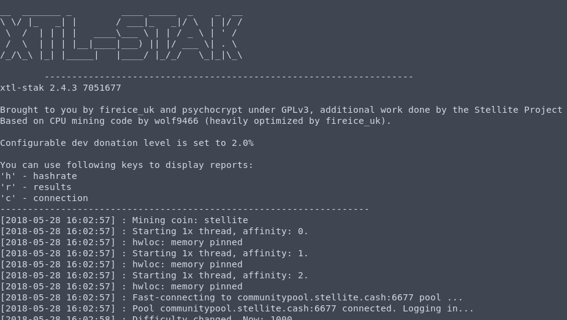

# XTL-Stak - Stellite All-in-One Mining Software

**XTL-Stak is ready for the PoW of Stellite V4**

XTL-Stak is a universal Stratum pool miner. This miner supports CPUs, AMD and NVIDIA GPUs and can be used to mine the crypto currency Stellite, Monero, Aeon and others.

###### This fork includes updates for Stellite, original code created by [fireice-uk and psychocrypt](https://github.com/fireice-uk/xmr-stak)

## HTML reports
  



## Video setup guide on Windows

[](https://youtu.be/YNMa8NplWus)
###### Video by Crypto Sewer

## Overview
* [Features](#features)
* [Supported altcoins](#supported-altcoins)
* [Download](#download)
* [Usage](doc/usage.md)
* [HowTo Compile](doc/compile.md)
* [FAQ](doc/FAQ.md)
* [Developer Donation](#default-developer-donation)
* [Developer PGP Key's](doc/pgp_keys.md)

## Features

- support all common backends (CPU/x86, AMD-GPU and NVIDIA-GPU)
- support all common OS (Linux, Windows and macOS)
- supports algorithm cryptonight for Monero (XMR) and cryptonight-light (AEON)
- easy to use
  - guided start (no need to edit a config file for the first start)
  - auto configuration for each backend
- open source software (GPLv3)
- TLS support
- [HTML statistics](doc/usage.md#html-and-json-api-report-configuraton)
- [JSON API for monitoring](doc/usage.md#html-and-json-api-report-configuraton)

## Supported altcoins

Besides [Stellite](https://stellite.cash), following coins can be mined using this miner:

- [Monero](https://getmonero.org)
- [Aeon](http://www.aeon.cash)
- [BBSCoin](https://www.bbscoin.xyz)
- [Croat](https://croat.cat)
- [Edollar](https://edollar.cash)
- [Electroneum](https://electroneum.com)
- [Graft](https://www.graft.network)
- [Haven](https://havenprotocol.com)
- [Intense](https://intensecoin.com)
- [IPBC](https://ipbc.io)
- [Karbo](https://karbo.io)
- [Masari](https://getmasari.org)
- [Sumokoin](https://www.sumokoin.org)
- [TurtleCoin](https://turtlecoin.lol)

If your prefered coin is not listed, you can chose one of the following algorithms:

- Cryptonight - 2 MiB scratchpad memory
- Cryptonight-light - 1 MiB scratchpad memory

Please note, this list is not complete, and is not an endorsement.

## Download

You can find the latest releases and precompiled binaries on GitHub under [Releases](https://github.com/stellitecoin/xtl-stak/releases).

## Default Developer Donation

By default the miner will donate 2% of the hashpower (2 minute in 100 minutes) to Stellite's donation pool. If you want to change that, edit [donate-level.hpp](xmrstak/donate-level.hpp) before you build the binaries.

If you want to donate directly to support further development of the original XMR-stak, here are their wallets

fireice-uk:
```
4581HhZkQHgZrZjKeCfCJxZff9E3xCgHGF25zABZz7oR71TnbbgiS7sK9jveE6Dx6uMs2LwszDuvQJgRZQotdpHt1fTdDhk
```

psychocrypt:
```
45tcqnJMgd3VqeTznNotiNj4G9PQoK67TGRiHyj6EYSZ31NUbAfs9XdiU5squmZb717iHJLxZv3KfEw8jCYGL5wa19yrVCn
```
